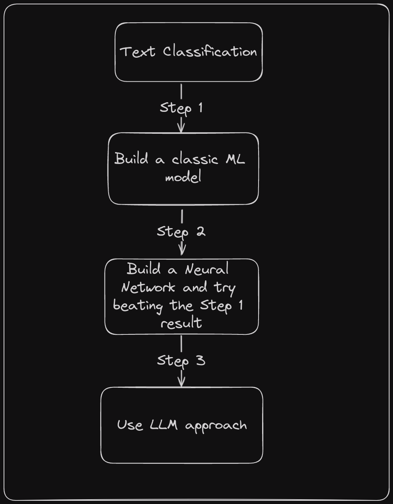

# Machine-Learning-Classification

## Goal
The main focus of this repository is to learn how text classification works using classic ML models like TF-IDF and Naive Bayes to more sophisticated models like Neural Networks, Transformers and LLMs.

# Approach
The approach would be to first build a baseline ML model using Naive Bayes for Spam or Ham detection and then use more sophisticated methods to try beat the baseline model.

There would be a series of theory README for all of the models used in this repo along with the resources and maybe a blog on Medium.

# Dataset
The data used for this repo is a collection of disaster tweets which would be used. 

The data has two classes, 1 and 0.

* 1 represents disaster tweets.
* 0 represents non-disaster tweets.

The dataset can be found on kaggle here: [Disaster Tweet Classification](https://www.kaggle.com/competitions/nlp-getting-started/data)